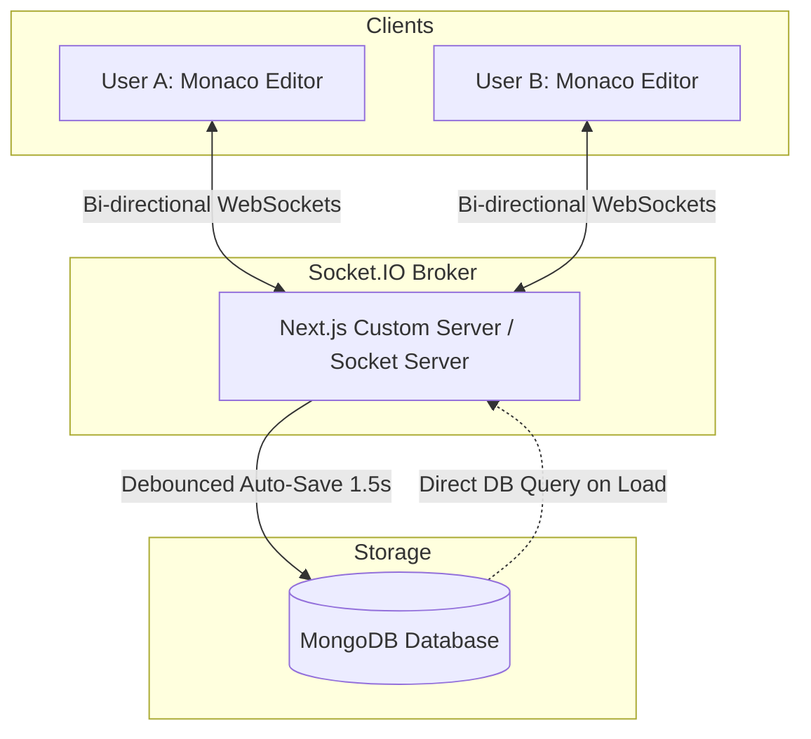

# 🚀 CodeShare 2.0

A pixel-accurate, premium, and production-ready real-time collaborative code editor clone of CodeShare.io. Built with Next.js 14, Monaco Editor, Socket.IO, and MongoDB, this app supports live multiplayer typing, custom styled cursors with floating username tags, high-fidelity real-time selection highlighting, dynamic language changes, and robust document persistence.

---

<p align="center">
  
  
  
  
  
  
</p>

---

## 🛠️ System Architecture

CodeShare 2.0 is designed as a hybrid real-time application. It features a Next.js frontend communicating with a Socket.IO backend. Edits, cursor motions, and selection vectors are instantly broadcast to other active peers, while room state is persisted reliably in MongoDB via a debounced auto-save mechanism.



### Key Architectural Highlights
1. **Low-Latency Broadcast**: Socket.IO handles cursor coordinates, language changes, and document edits, bypassing database traffic.
2. **Debounced DB Write (1.5s)**: To prevent MongoDB bottlenecks during high-speed typing, code updates are debounced by `1500ms` before saving.
3. **Fail-Safe Serverless Loading**: Direct DB loading occurs on the server side (`getServerSideProps`/`app` routing context) to bypass HTTP roundtripping overheads.

---

## 🌟 Premium Features

- **⚡ Multiplayer Collaboration**:
  - **Real-Time Keystroke Sync**: Synchronize document modifications instantly across active editors.
  - **Personalized Floating Cursors**: Dynamic, color-coded remote cursors with beautiful floating username badges displaying peer names.
  - **Live Selection Ranges**: Highlights code selection overlays for all connected users, utilizing custom colors per collaborator.
- **📁 Room Routing**:
  - **Custom Room Names**: Simply type your custom route (`/c/my-room-name`) to create a secure, persistent room.
  - **Automatic Generation**: Click "Create a Random Workspace" to instantiate a clean room with an 8-byte cryptographically-secure URL string.
- **🎛️ Monaco Editor Customizations**:
  - **Dynamic Language Selector**: Instantly transition between 30+ syntax modes (TypeScript, Python, Rust, Go, CSS, etc.).
  - **Keybindings Helper**: Click `Ctrl + /` or use the menu toolbar to toggle the keyboard shortcuts overlay.
- **🔐 View modes**:
  - **Read-Only Mode**: Append `?view=1` to the URL. Perfect for presenting code or restricting unauthorized edits.
  - **Embed Mode**: Append `?embed=1` to generate a borderless, styling-stripped workspace for iframe embed usage.
- **💾 Save & Download**:
  - **MongoDB Persistence**: Stored rooms are persistent, and documents do not expire.
  - **Local Code Download**: Instantly package your work and trigger a local file download based on the currently selected extension.

---

## 📂 Repository Structure

```yaml
codeshare-2.0/
├── app/                  # Next.js 14 App Router
│   ├── api/              # Backend endpoint routes
│   ├── c/[roomId]/       # Dynamic room routes & view controllers
│   ├── layout.tsx        # Application root layout with custom theme tokens
│   └── page.tsx          # Landing page with interactive collaborative editor mockups
├── components/           # UI Components
│   ├── Editor.tsx        # Monaco Editor mounting, selections & cursor tracking logic
│   ├── EditorWrapper.tsx # Client-side dynamic wrapper preventing Server-Side Rendering (SSR) issues
│   ├── KeybindingsModal.tsx # Shortcuts information overlay (Ctrl + /)
│   ├── PresenceDot.tsx   # Visual indicator representing local socket status
│   ├── StatusBar.tsx     # Editor bottom-bar showing cursor line/column, language, and connection stats
│   └── Toolbar.tsx       # Sidebar dashboard for actions, sharing, lock controls, and language toggle
├── lib/                  # Utilities & Database wrappers
│   ├── languages.ts      # Mapping of Monaco support schemas and file extensions
│   ├── mongodb.ts        # Database connection pool manager with globally cached handles
│   └── socket.ts         # Socket.IO client interface with intelligent local/remote URL routing
├── models/               # Database schemas
│   └── Room.ts           # Mongoose Schema detailing Room data (code, roomId, syntax language)
├── server.js             # Monolithic Next.js + Socket.IO custom HTTP server
├── socket-server.js      # Standalone socket server for split-process production scaling
└── tailwind.config.js    # Tailwind configuration for custom grids and animations
```

---

## ⚙️ Quick Start & Local Setup

### 1. Pre-requisites
- **Node.js** v18+ 
- **MongoDB** instance running locally or on MongoDB Atlas.

### 2. Installation
Clone the repository and install the project dependencies:
```bash
git clone https://github.com/Diganta18-noob/codeshare2.0.git
cd codeshare2.0
npm install
```

### 3. Environment Variables
Create a `.env.local` file in the root directory and configure your MongoDB connection:
```env
MONGODB_URI=mongodb://127.0.0.1:27017/codeshare
NEXT_PUBLIC_SOCKET_URL=http://localhost:3000
```

### 4. Running the Application

Choose your preferred setup:

#### Option A: Monolithic Server (Recommended for Development)
Runs Next.js and Socket.IO together on port `3000`:
```bash
npm run dev
```
Open [http://localhost:3000](http://localhost:3000) in your browser.

#### Option B: Split Processes (Recommended for Scaled Production)
Runs the Next.js frontend and a separate WebSocket gateway server on port `3001`:
```bash
# Terminal 1: Run Next.js Frontend
npm run dev:frontend

# Terminal 2: Run WebSocket Backend
npm run dev:backend
```

---

## 💡 Keyboard Shortcuts

| Shortcut | Action |
| --- | --- |
| `Ctrl + /` | Open Keybindings Guide |
| `Ctrl + S` | Force Database Sync (Manual Save) |
| `Alt + D` | Download Code File |
| `Alt + L` | Toggle View-Only/Editable Mode |
| `Alt + S` | Focus/Open Share Dialog |

---

## 📜 Contributing & License

Contributions, issues, and feature requests are welcome! Feel free to check the [issues page](https://github.com/Diganta18-noob/codeshare2.0/issues).

Distributed under the MIT License. See [LICENSE](LICENSE) for more details.
